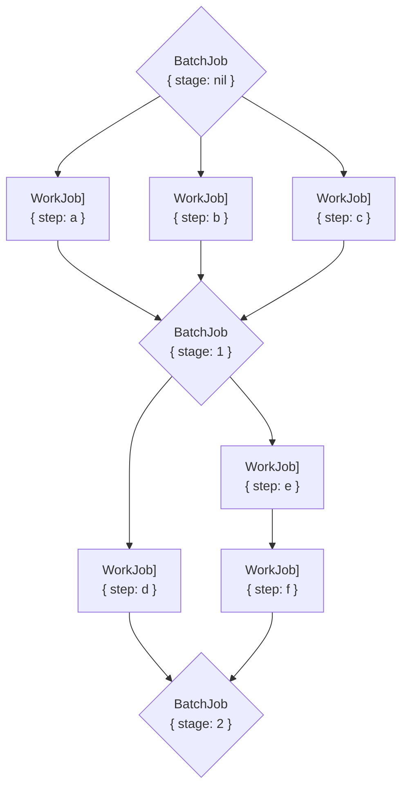

# GoodJob

[](https://rubygems.org/gems/good_job)
[](https://github.com/bensheldon/good_job/actions/workflows/test.yml?query=branch%3Amain)
[](https://www.ruby-toolbox.com/projects/good_job)

GoodJob is a multithreaded, Postgres-based, Active Job backend for Ruby on Rails.

**Inspired by [Delayed::Job](https://github.com/collectiveidea/delayed_job) and [Que](https://github.com/que-rb/que), GoodJob is designed for maximum compatibility with Ruby on Rails, Active Job, and Postgres to be simple and performant for most workloads.**

- **Designed for Active Job.** Complete support for [async, queues, delays, priorities, timeouts, and retries](https://edgeguides.rubyonrails.org/active_job_basics.html) with near-zero configuration.
- **Built for Rails.** Fully adopts Ruby on Rails [threading and code execution guidelines](https://guides.rubyonrails.org/threading_and_code_execution.html) with [Concurrent::Ruby](https://github.com/ruby-concurrency/concurrent-ruby).
- **Backed by Postgres.** Relies upon Postgres integrity, session-level Advisory Locks to provide run-once safety and stay within the limits of `schema.rb`, and LISTEN/NOTIFY to reduce queuing latency.
- **For most workloads.** Targets full-stack teams, economy-minded solo developers, and applications that enqueue 1-million jobs/day and more.

For more of the story of GoodJob, read the [introductory blog post](https://island94.org/2020/07/introducing-goodjob-1-0).

<details markdown="1">
<summary><strong>📊 Comparison of GoodJob with other job queue backends (click to expand)</strong></summary>

|                 | Queues, priority, retries | Database                              | Concurrency       | Reliability/Integrity  | Latency                  |
|-----------------|---------------------------|---------------------------------------|-------------------|------------------------|--------------------------|
| **GoodJob**     | ✅ Yes                     | ✅ Postgres                            | ✅ Multithreaded   | ✅ ACID, Advisory Locks | ✅ Postgres LISTEN/NOTIFY |
| **Que**         | ✅ Yes                     | 🔶️ Postgres, requires  `structure.sql` | ✅ Multithreaded   | ✅ ACID, Advisory Locks | ✅ Postgres LISTEN/NOTIFY |
| **Delayed Job** | ✅ Yes                     | ✅ Postgres                            | 🔴 Single-threaded | ✅ ACID, record-based   | 🔶 Polling                |
| **Sidekiq**     | ✅ Yes                     | 🔴 Redis                               | ✅ Multithreaded   | 🔴 Crashes lose jobs    | ✅ Redis BRPOP            |
| **Sidekiq Pro** | ✅ Yes                     | 🔴 Redis                               | ✅ Multithreaded   | ✅ Redis RPOPLPUSH      | ✅ Redis RPOPLPUSH        |

</details>

## Table of contents

- [Set up](#set-up)
- [Compatibility](#compatibility)
- [Configuration](#configuration)
    - [Command-line options](#command-line-options)
        - [`good_job start`](#good_job-start)
        - [`good_job cleanup_preserved_jobs`](#good_job-cleanup_preserved_jobs)
    - [Configuration options](#configuration-options)
    - [Global options](#global-options)
    - [Dashboard](#dashboard)
        - [API-only Rails applications](#api-only-rails-applications)
        - [Live polling](#live-polling)
    - [Job priority](#job-priority)
    - [Concurrency controls](#concurrency-controls)
        - [How concurrency controls work](#how-concurrency-controls-work)
    - [Cron-style repeating/recurring jobs](#cron-style-repeatingrecurring-jobs)
    - [Bulk enqueue](#bulk-enqueue)
    - [Batches](#batches)
    - [Updating](#updating)
        - [Upgrading minor versions](#upgrading-minor-versions)
        - [Upgrading v2 to v3](#upgrading-v2-to-v3)
        - [Upgrading v1 to v2](#upgrading-v1-to-v2)
- [Go deeper](#go-deeper)
    - [Exceptions, retries, and reliability](#exceptions-retries-and-reliability)
        - [Exceptions](#exceptions)
        - [Retries](#retries)
        - [Action Mailer retries](#action-mailer-retries)
        - [Interrupts](#interrupts)
    - [Timeouts](#timeouts)
    - [Optimize queues, threads, and processes](#optimize-queues-threads-and-processes)
    - [Database connections](#database-connections)
    - [Production setup](#production-setup)
    - [Queue performance with Queue Select Limit](#queue-performance-with-queue-select-limit)
    - [Execute jobs async / in-process](#execute-jobs-async--in-process)
    - [Migrate to GoodJob from a different Active Job backend](#migrate-to-goodjob-from-a-different-active-job-backend)
    - [Monitor and preserve worked jobs](#monitor-and-preserve-worked-jobs)
    - [Write tests](#write-tests)
    - [PgBouncer compatibility](#pgbouncer-compatibility)
    - [CLI HTTP health check probes](#cli-http-health-check-probes)
- [Contribute](#contribute)
    - [Gem development](#gem-development)
        - [Development setup](#development-setup)
        - [Rails development harness](#rails-development-harness)
        - [Running tests](#running-tests)
    - [Release](#release)
- [License](#license)

## Set up

1. Add `good_job` to your application's Gemfile and install the gem:

    ```sh
    bundle add good_job
    ```

1. Run the GoodJob install generator. This will generate a database migration to create a table for GoodJob's job records:

    ```bash
    bin/rails g good_job:install
    ```

    Run the migration:

    ```bash
    bin/rails db:migrate
    ```

   Optional: If using Rails' multiple databases with the `migrations_paths` configuration option, use the `--database` option:

    ```bash
    bin/rails g good_job:install --database animals
    bin/rails db:migrate:animals
    ```

1. Configure the Active Job adapter:

    ```ruby
    # config/application.rb or config/environments/{RAILS_ENV}.rb
    config.active_job.queue_adapter = :good_job
    ```

1. Inside of your application, queue your job 🎉:

    ```ruby
    YourJob.perform_later
    ```

    GoodJob supports all Active Job features:

    ```ruby
    YourJob.set(queue: :some_queue, wait: 5.minutes, priority: 10).perform_later
    ```

1. **In Rails' development environment**, by default, GoodJob's Adapter executes jobs `async` in a background thread pool in `rails server`.
    - Because of Rails deferred autoloading, jobs enqueued via the `rails console` may not begin executing on a separate server process until the Rails application is fully initialized by loading a web page once.
    - Remember, only Active Job's `perform_later` sends jobs to the queue adapter; Active Job's `perform_now` executes the job immediately and does not invoke the queue adapter. GoodJob is not involved in `perform_now` jobs.
1. **In Rails' test environment**, by default, GoodJob's Adapter executes jobs `inline` immediately in the current thread.
    - Future-scheduled jobs can be executed with `GoodJob.perform_inline` using using a tool like Timecop or `ActiveSupport::Testing::TimeHelpers`.
    - Note that Active Job's TestAdapter, which powers test helpers (e.g. `assert_enqueued_with`), may override GoodJob's Adapter in [some configurations](https://github.com/rails/rails/issues/37270).
1. **In Rails' production environment**, by default, GoodJob's Adapter enqueues jobs in `external` mode to be executed by a separate execution process:
    - By default, GoodJob separates job enqueuing from job execution so that jobs can be scaled independently of the web server.  Use the GoodJob command-line tool to execute jobs:

        ```bash
        bundle exec good_job start
        ```

        Ideally the command-line tool should be run on a separate machine or container from the web process. For example, on Heroku:

        ```Procfile
        web: rails server
        worker: bundle exec good_job start
        ```

        The command-line tool supports a variety of options, see the reference below for command-line configuration.

    - GoodJob can also be configured to execute jobs within the web server process to save on resources. This is useful for low-workloads when economy is paramount.

        ```bash
        GOOD_JOB_EXECUTION_MODE=async rails server
        ```

        Additional configuration is likely necessary, see the reference below for configuration.

## Compatibility

- **Ruby on Rails:** 6.0+
- **Ruby:** Ruby 2.6+. JRuby 9.3+
- **Postgres:** 10.0+

## Configuration

### Command-line options

There are several top-level commands available through the `good_job` command-line tool.

Configuration options are available with `help`.

#### `good_job start`

`good_job start` executes queued jobs.

```bash
$ bundle exec good_job help start

Usage:
  good_job start

Options:
  [--queues=QUEUE_LIST]           # Queues or pools to work from. (env var: GOOD_JOB_QUEUES, default: *)
  [--max-threads=COUNT]           # Default number of threads per pool to use for working jobs. (env var: GOOD_JOB_MAX_THREADS, default: 5)
  [--poll-interval=SECONDS]       # Interval between polls for available jobs in seconds (env var: GOOD_JOB_POLL_INTERVAL, default: 10)
  [--max-cache=COUNT]             # Maximum number of scheduled jobs to cache in memory (env var: GOOD_JOB_MAX_CACHE, default: 10000)
  [--shutdown-timeout=SECONDS]    # Number of seconds to wait for jobs to finish when shutting down before stopping the thread. (env var: GOOD_JOB_SHUTDOWN_TIMEOUT, default: -1 (forever))
  [--enable-cron]                 # Whether to run cron process (default: false)
  [--enable-listen-notify]        # Whether to enqueue and read jobs with Postgres LISTEN/NOTIFY (default: true)
  [--idle-timeout=SECONDS]        # Exit process when no jobs have been performed for this many seconds (env var: GOOD_JOB_IDLE_TIMEOUT, default: nil)
  [--daemonize]                   # Run as a background daemon (default: false)
  [--pidfile=PIDFILE]             # Path to write daemonized Process ID (env var: GOOD_JOB_PIDFILE, default: tmp/pids/good_job.pid)
  [--probe-port=PORT]             # Port for http health check (env var: GOOD_JOB_PROBE_PORT, default: nil)
  [--probe-handler=PROBE_HANDLER] # Use 'webrick' to use WEBrick to handle probe server requests which is Rack compliant, otherwise default server that is not Rack compliant is used.
  [--queue-select-limit=COUNT]    # The number of queued jobs to select when polling for a job to run. (env var: GOOD_JOB_QUEUE_SELECT_LIMIT, default: nil)"

Executes queued jobs.

All options can be configured with environment variables.
See option descriptions for the matching environment variable name.

== Configuring queues

Separate multiple queues with commas; exclude queues with a leading minus;
separate isolated execution pools with semicolons and threads with colons.
```

#### `good_job cleanup_preserved_jobs`

`good_job cleanup_preserved_jobs` destroys preserved job records. See `GoodJob.preserve_job_records` for when this command is useful.

```bash
$ bundle exec good_job help cleanup_preserved_jobs

Usage:
  good_job cleanup_preserved_jobs

Options:
  [--before-seconds-ago=SECONDS] # Destroy records finished more than this many seconds ago (env var:  GOOD_JOB_CLEANUP_PRESERVED_JOBS_BEFORE_SECONDS_AGO, default: 1209600 (14 days))

Manually destroys preserved job records.

By default, GoodJob automatically destroys job records when the job is performed
and this command is not required to be used.
```

### Configuration options

Active Job configuration depends on where the code is placed:

- `config.active_job.queue_adapter = :good_job` within `config/application.rb` or `config/environments/*.rb`.
- `ActiveJob::Base.queue_adapter = :good_job` within an initializer (e.g. `config/initializers/active_job.rb`).

GoodJob configuration can be placed within Rails `config` directory for all environments (`config/application.rb`), within a particular environment (e.g. `config/environments/development.rb`), or within an initializer (e.g. `config/initializers/good_job.rb`).

Configuration examples:

```ruby
# config/initializers/good_job.rb OR config/application.rb OR config/environments/{RAILS_ENV}.rb

Rails.application.configure do
  # Configure options individually...
  config.good_job.preserve_job_records = true
  config.good_job.retry_on_unhandled_error = false
  config.good_job.on_thread_error = -> (exception) { Rails.error.report(exception) }
  config.good_job.execution_mode = :async
  config.good_job.queues = '*'
  config.good_job.max_threads = 5
  config.good_job.poll_interval = 30 # seconds
  config.good_job.shutdown_timeout = 25 # seconds
  config.good_job.enable_cron = true
  config.good_job.cron = { example: { cron: '0 * * * *', class: 'ExampleJob'  } }
  config.good_job.dashboard_default_locale = :en

  # ...or all at once.
  config.good_job = {
    preserve_job_records: true,
    retry_on_unhandled_error: false,
    on_thread_error: -> (exception) { Rails.error.report(exception) },
    execution_mode: :async,
    queues: '*',
    max_threads: 5,
    poll_interval: 30,
    shutdown_timeout: 25,
    enable_cron: true,
    cron: {
      example: {
        cron: '0 * * * *',
        class: 'ExampleJob'
      },
    },
    dashboard_default_locale: :en,
  }
end
```

Available configuration options are:

- `execution_mode` (symbol) specifies how and where jobs should be executed. You can also set this with the environment variable `GOOD_JOB_EXECUTION_MODE`. It can be any one of:
    - `:inline` executes jobs immediately in whatever process queued them (usually the web server process). This should only be used in test and development environments.
    - `:external` causes the adapter to enqueue jobs, but not execute them. When using this option (the default for production environments), you’ll need to use the command-line tool to actually execute your jobs.
    - `:async` (or `:async_server`) executes jobs in separate threads within the Rails web server process (`bundle exec rails server`). It can be more economical for small workloads because you don’t need a separate machine or environment for running your jobs, but if your web server is under heavy load or your jobs require a lot of resources, you should choose `:external` instead.  When not in the Rails web server, jobs will execute in `:external` mode to ensure jobs are not executed within `rails console`, `rails db:migrate`, `rails assets:prepare`, etc.
    - `:async_all` executes jobs in separate threads in _any_ Rails process.
- `queues` (string) sets queues or pools to execute jobs. You can also set this with the environment variable `GOOD_JOB_QUEUES`.
- `max_threads` (integer) sets the default number of threads per pool to use for working jobs. You can also set this with the environment variable `GOOD_JOB_MAX_THREADS`.
- `poll_interval` (integer) sets the number of seconds between polls for jobs when `execution_mode` is set to `:async`. You can also set this with the environment variable `GOOD_JOB_POLL_INTERVAL`. A poll interval of `-1` disables polling completely.
    - production default: 10 seconds (in case of a LISTEN/NOTIFY blip)
    - development default: -1, disabled (because the application is likely being restarted often and won't be running unobserved). You can enable it by setting a `poll_interval`.
    - LISTEN/NOTIFY is enabled in both production and development, so polling is not strictly necessary.
    - If LISTEN/NOTIFY is disabled, you should configure polling for future-scheduled jobs. GoodJob will cache in memory the scheduled time and check for executable jobs at that time. If the cache is exceeded (10k scheduled jobs by default) that's another reason to poll just in case.
- `max_cache` (integer) sets the maximum number of scheduled jobs that will be stored in memory to reduce execution latency when also polling for scheduled jobs. Caching 10,000 scheduled jobs uses approximately 20MB of memory. You can also set this with the environment variable `GOOD_JOB_MAX_CACHE`.
- `shutdown_timeout` (integer) number of seconds to wait for jobs to finish when shutting down before stopping the thread. Defaults to forever: `-1`. You can also set this with the environment variable `GOOD_JOB_SHUTDOWN_TIMEOUT`.
- `enable_cron` (boolean) whether to run cron process. Defaults to `false`. You can also set this with the environment variable `GOOD_JOB_ENABLE_CRON`.
- `enable_listen_notify` (boolean) whether to enqueue and read jobs with Postgres LISTEN/NOTIFY. Defaults to `true`. You can also set this with the environment variable `GOOD_JOB_ENABLE_LISTEN_NOTIFY`.
- `cron` (hash) cron configuration. Defaults to `{}`. You can also set this as a JSON string with the environment variable `GOOD_JOB_CRON`
- `cleanup_discarded_jobs` (boolean) whether to destroy discarded jobs when cleaning up preserved jobs using the `$ good_job cleanup_preserved_jobs` CLI command or calling `GoodJob.cleanup_preserved_jobs`. Defaults to `true`. Can also be set with  the environment variable `GOOD_JOB_CLEANUP_DISCARDED_JOBS`. _This configuration is only used when {GoodJob.preserve_job_records} is `true`._
- `cleanup_preserved_jobs_before_seconds_ago` (integer) number of seconds to preserve jobs when using the `$ good_job cleanup_preserved_jobs` CLI command or calling `GoodJob.cleanup_preserved_jobs`. Defaults to `1209600` (14 days). Can also be set with  the environment variable `GOOD_JOB_CLEANUP_PRESERVED_JOBS_BEFORE_SECONDS_AGO`.  _This configuration is only used when {GoodJob.preserve_job_records} is `true`._
- `cleanup_interval_jobs` (integer) Number of jobs a Scheduler will execute before cleaning up preserved jobs. Defaults to `1000`. Disable with `false`. Can also be set with  the environment variable `GOOD_JOB_CLEANUP_INTERVAL_JOBS` and disabled with `0`).
- `cleanup_interval_seconds` (integer) Number of seconds a Scheduler will wait before cleaning up preserved jobs. Defaults to `600` (10 minutes). Disable with `false`. Can also be set with  the environment variable `GOOD_JOB_CLEANUP_INTERVAL_SECONDS` and disabled with `0`).
- `inline_execution_respects_schedule` (boolean) Opt-in to future behavior of inline execution respecting scheduled jobs. Defaults to `false`.
- `logger` ([Rails Logger](https://api.rubyonrails.org/classes/ActiveSupport/Logger.html)) lets you set a custom logger for GoodJob. It should be an instance of a Rails `Logger` (Default: `Rails.logger`).
- `preserve_job_records` (boolean) keeps job records in your database even after jobs are completed. (Default: `true`)
- `smaller_number_is_higher_priority` (boolean) allows you to specifiy that jobs should be run in ascending order of priority (smallest priority numbers first). This will be enabled by default in the next major version of GoodJob (v4.0), but jobs with the highest priority number are run first by default in all earlier versions of GoodJob.
- `retry_on_unhandled_error` (boolean) causes jobs to be re-queued and retried if they raise an instance of `StandardError`. Be advised this may lead to jobs being repeated infinitely ([see below for more on retries](#retries)). Instances of `Exception`, like SIGINT, will *always* be retried, regardless of this attribute’s value. (Default: `false`)
- `on_thread_error` (proc, lambda, or callable) will be called when there is an Exception. It can be useful for logging errors to bug tracking services, like Sentry or Airbrake. Example:

    ```ruby
    config.good_job.on_thread_error = -> (exception) { Rails.error.report(exception) }
    ```

- `probe_server_app` (Rack application) allows you to specify a Rack application to be used for the probe server. Defaults to `nil` which uses the default probe server. Example:

    ```ruby
    config.good_job.probe_app = -> (env) { [200, {}, ["OK"]] }
    ```

- `probe_handler` (string) allows you to use WEBrick, a fully Rack compliant webserver instead of the simple default server. **Note:** You'll need to ensure WEBrick is in your load path as GoodJob doesn't have WEBrick as a dependency. Example:

    ```ruby
    config.good_job.probe_handler = 'webrick'
    ```

By default, GoodJob configures the following execution modes per environment:

```ruby

# config/environments/development.rb
config.active_job.queue_adapter = :good_job
config.good_job.execution_mode = :async

# config/environments/test.rb
config.active_job.queue_adapter = :good_job
config.good_job.execution_mode = :inline

# config/environments/production.rb
config.active_job.queue_adapter = :good_job
config.good_job.execution_mode = :external
```

### Global options

Good Job’s general behavior can also be configured via attributes directly on the `GoodJob` module:

- **`GoodJob.configure_active_record { ... }`** Inject Active Record configuration into GoodJob's base model, for example, when using [multiple databases with Active Record](https://guides.rubyonrails.org/active_record_multiple_databases.html) or when other custom configuration is necessary for the Active Record model to connect to the Postgres database. Example:

    ```ruby
    # config/initializers/good_job.rb
    GoodJob.configure_active_record do
      connects_to database: :special_database
      self.table_name_prefix = "special_application_"
    end
    ```

- **`GoodJob.active_record_parent_class`** (string) Alternatively, modify the Active Record parent class inherited by GoodJob's Active Record model `GoodJob::Job` (defaults to `"ActiveRecord::Base"`). Configure this _The value must be a String to avoid premature initialization of Active Record._

You’ll generally want to configure these in `config/initializers/good_job.rb`, like so:

```ruby
# config/initializers/good_job.rb
GoodJob.active_record_parent_class = "ApplicationRecord"
```

The following options are also configurable via accessors, but you are encouraged to use the configuration attributes instead because these may be deprecated and removed in the future:

- **`GoodJob.logger`** ([Rails Logger](https://api.rubyonrails.org/classes/ActiveSupport/Logger.html)) lets you set a custom logger for GoodJob. It should be an instance of a Rails `Logger`.
- **`GoodJob.preserve_job_records`** (boolean) keeps job records in your database even after jobs are completed. (Default: `true`)
- **`GoodJob.retry_on_unhandled_error`** (boolean) causes jobs to be re-queued and retried if they raise an instance of `StandardError`. Be advised this may lead to jobs being repeated infinitely ([see below for more on retries](#retries)). Instances of `Exception`, like SIGINT, will *always* be retried, regardless of this attribute’s value. (Default: `false`)
- **`GoodJob.on_thread_error`** (proc, lambda, or callable) will be called when there is an Exception. It can be useful for logging errors to bug tracking services, like Sentry or Airbrake.

### Dashboard


_🚧 GoodJob's dashboard is a work in progress. Please contribute ideas and code on [Github](https://github.com/bensheldon/good_job/issues)._

GoodJob includes a Dashboard as a mountable `Rails::Engine`.

1. Mount the engine in your `config/routes.rb` file. The following will mount it at `http://example.com/good_job`.

    ```ruby
    # config/routes.rb
    # ...
    mount GoodJob::Engine => 'good_job'
    ```

1. Configure authentication. Because jobs can potentially contain sensitive information, you should authorize access. For example, using Devise's `authenticate` helper, that might look like:

    ```ruby
    # config/routes.rb
    # ...
    authenticate :user, ->(user) { user.admin? } do
      mount GoodJob::Engine => 'good_job'
    end
    ```

    Another option is using basic auth like this:

    ```ruby
    # config/initializers/good_job.rb
    GoodJob::Engine.middleware.use(Rack::Auth::Basic) do |username, password|
      ActiveSupport::SecurityUtils.secure_compare(Rails.application.credentials.good_job_username, username) &&
        ActiveSupport::SecurityUtils.secure_compare(Rails.application.credentials.good_job_password, password)
    end
    ```

    To support custom authentication, you can extend GoodJob's `ApplicationController` using the following hook:

    ```ruby
    # config/initializers/good_job.rb

    ActiveSupport.on_load(:good_job_application_controller) do
      # context here is GoodJob::ApplicationController

      before_action do
        raise ActionController::RoutingError.new('Not Found') unless current_user&.admin?
      end

      def current_user
        # load current user
      end
    end
    ```

_To view finished jobs (succeeded and discarded) on the Dashboard, GoodJob must be configured to preserve job records. Preservation is enabled by default._

**Troubleshooting the Dashboard:** Some applications are unable to autoload the Goodjob Engine. To work around this, explicitly require the Engine at the top of your `config/application.rb` file, immediately after Rails is required and before Bundler requires the Rails' groups.

```ruby
# config/application.rb
require_relative 'boot'
require 'rails/all'
require 'good_job/engine' # <= Add this line
# ...
```

#### API-only Rails applications

API-only Rails applications may not have all of the required Rack middleware for the GoodJob Dashboard to function. To re-add the middleware:

```ruby
# config/application.rb
module MyApp
  class Application < Rails::Application
    #...
    config.middleware.use Rack::MethodOverride
    config.middleware.use ActionDispatch::Flash
    config.middleware.use ActionDispatch::Cookies
    config.middleware.use ActionDispatch::Session::CookieStore
  end
end
```

#### Live polling

The Dashboard can be set to automatically refresh by checking "Live Poll" in the Dashboard header, or by setting `?poll=10` with the interval in seconds (default 30 seconds).

### Job priority

Higher priority numbers run first in all versions of GoodJob v3.x and below. GoodJob v4.x will change job `priority` to give smaller numbers higher priority (default: `0`), in accordance with Active Job's definition of priority (see #524). To opt-in to this behavior now, set `config.good_job.smaller_number_is_higher_priority = true` in your GoodJob initializer or `application.rb`.

### Labelled jobs

Labels are the recommended way to add context or metadata to specific jobs. For example, all jobs that have a dependency on an email service could be labeled `email`. Using labels requires adding the Active Job extension `GoodJob::ActiveJobExtensions::Labels` to your job class.

```ruby
class ApplicationRecord < ActiveJob::Base
  include GoodJob::ActiveJobExtensions::Labels
end

# Add a default label to every job within the class
class WelcomeJob < ApplicationRecord
  self.good_job_labels = ["email"]

  def perform
    # Labels can be inspected from within the job
    puts good_job_labels # => ["email"]
  end
end

# Or add to individual jobs when enqueued
WelcomeJob.set(good_job_labels: ["email"]).perform_later
```

Labels can be used to search jobs in the Dashboard. For example, to find all jobs labeled `email`, search for `email`.

### Concurrency controls

GoodJob can extend Active Job to provide limits on concurrently running jobs, either at time of _enqueue_ or at _perform_. Limiting concurrency can help prevent duplicate, double or unnecessary jobs from being enqueued, or race conditions when performing, for example when interacting with 3rd-party APIs.

```ruby
class MyJob < ApplicationJob
  include GoodJob::ActiveJobExtensions::Concurrency

  good_job_control_concurrency_with(
    # Maximum number of unfinished jobs to allow with the concurrency key
    # Can be an Integer or Lambda/Proc that is invoked in the context of the job
    total_limit: 1,

    # Or, if more control is needed:
    # Maximum number of jobs with the concurrency key to be
    # concurrently enqueued (excludes performing jobs)
    # Can be an Integer or Lambda/Proc that is invoked in the context of the job
    enqueue_limit: 2,

    # Maximum number of jobs with the concurrency key to be
    # concurrently performed (excludes enqueued jobs)
    # Can be an Integer or Lambda/Proc that is invoked in the context of the job
    perform_limit: 1,

    # Note: Under heavy load, the total number of jobs may exceed the
    # sum of `enqueue_limit` and `perform_limit` because of race conditions
    # caused by imperfectly disjunctive states. If you need to constrain
    # the total number of jobs, use `total_limit` instead. See #378.

    # A unique key to be globally locked against.
    # Can be String or Lambda/Proc that is invoked in the context of the job.
    # Note: Arguments passed to #perform_later can be accessed through Active Job's `arguments` method
    # which is an array containing positional arguments and, optionally, a kwarg hash.
    key: -> { "MyJob-#{arguments.first}-#{arguments.last[:version]}" } #  MyJob.perform_later("Alice", version: 'v2') => "MyJob-Alice-v2"
  )

  def perform(first_name)
    # do work
  end
end
```

When testing, the resulting concurrency key value can be inspected:

```ruby
job = MyJob.perform_later("Alice")
job.good_job_concurrency_key #=> "MyJob-Alice"
```

#### How concurrency controls work

GoodJob's concurrency control strategy for `perform_limit` is "optimistic retry with an incremental backoff".  The [code is readable](https://github.com/bensheldon/good_job/blob/main/lib/good_job/active_job_extensions/concurrency.rb).

- "Optimistic" meaning that the implementation's performance trade-off assumes that collisions are atypical (e.g. two users enqueue the same job at the same time) rather than regular (e.g. the system enqueues thousands of colliding jobs at the same time). Depending on your concurrency requirements, you may also want to manage concurrency through the number of GoodJob threads and processes that are performing a given queue.
- "Retry with an incremental backoff" means that when `perform_limit` is exceeded, the job will raise a `GoodJob::ActiveJobExtensions::Concurrency::ConcurrencyExceededError` which is caught by a `retry_on` handler which re-schedules the job to execute in the near future with an incremental backoff.
- First-in-first-out job execution order is not preserved when a job is retried with incremental back-off.
- For pessimistic usecases that collisions are expected, use number of threads/processes (e.g., `good_job --queues "serial:1;-serial:5"`) to control concurrency. It is also a good idea to use `perform_limit` as backstop.

### Cron-style repeating/recurring jobs

GoodJob can enqueue Active Job jobs on a recurring basis that can be used as a replacement for cron.

Cron-style jobs can be performed by any GoodJob process (e.g., CLI or `:async` execution mode) that has `config.good_job.enable_cron` set to `true`. That is, one or more job executor processes can be configured to perform recurring jobs.

GoodJob's cron uses unique indexes to ensure that only a single job is enqueued at the given time interval. In order for this to work, GoodJob must preserve cron-created job records; these records will be automatically deleted like any other preserved record.

Cron-format is parsed by the [`fugit`](https://github.com/floraison/fugit) gem, which has support for seconds-level resolution (e.g. `* * * * * *`) and natural language parsing (e.g. `every second`).

If you use the [Dashboard](#dashboard) the scheduled tasks can be viewed in the 'cron' menu. In this view you can also disable a task or run/enqueue a task immediately.

```ruby
# config/environments/application.rb or a specific environment e.g. production.rb

# Enable cron in this process, e.g., only run on the first Heroku worker process
config.good_job.enable_cron = ENV['DYNO'] == 'worker.1' # or `true` or via $GOOD_JOB_ENABLE_CRON

# Configure cron with a hash that has a unique key for each recurring job
config.good_job.cron = {
  # Every 15 minutes, enqueue `ExampleJob.set(priority: -10).perform_later(42, "life", name: "Alice")`
  frequent_task: { # each recurring job must have a unique key
    cron: "*/15 * * * *", # cron-style scheduling format by fugit gem
    class: "ExampleJob", # name of the job class as a String; must reference an Active Job job class
    args: [42, "life"], # positional arguments to pass to the job; can also be a proc e.g. `-> { [Time.now] }`
    kwargs: { name: "Alice" }, # keyword arguments to pass to the job; can also be a proc e.g. `-> { { name: NAMES.sample } }`
    set: { priority: -10 }, # additional Active Job properties; can also be a lambda/proc e.g. `-> { { priority: [1,2].sample } }`
    description: "Something helpful", # optional description that appears in Dashboard
  },
  another_task: {
    cron: "0 0,12 * * *",
    class: "AnotherJob",
  },
  complex_schedule: {
    class: "ComplexScheduleJob",
    cron: -> (last_ran) { (last_ran.blank? ? Time.now : last_ran + 14.hours).at_beginning_of_minute }
  }
  # etc.
}
```

### Bulk enqueue

GoodJob's Bulk-enqueue functionality can buffer and enqueue multiple jobs at once, using a single INSERT statement. This can more performant when enqueuing a large number of jobs.

```ruby
# Capture jobs using `.perform_later`:
active_jobs = GoodJob::Bulk.enqueue do
  MyJob.perform_later
  AnotherJob.perform_later
  # If an exception is raised within this block, no jobs will be inserted.
end

# All Active Job instances are returned from GoodJob::Bulk.enqueue.
# Jobs that have been successfully enqueued have a `provider_job_id` set.
active_jobs.all?(&:provider_job_id)

# Bulk enqueue Active Job instances directly without using `.perform_later`:
GoodJob::Bulk.enqueue(MyJob.new, AnotherJob.new)
```

### Batches

Batches track a set of jobs, and enqueue an optional callback job when all of the jobs have finished (succeeded or discarded).

- A simple example that enqueues your `MyBatchCallbackJob` after the two jobs have finished, and passes along the current user as a batch property:

    ```ruby
    GoodJob::Batch.enqueue(on_finish: MyBatchCallbackJob, user: current_user) do
      MyJob.perform_later
      OtherJob.perform_later
    end

    # When these jobs have finished, it will enqueue your `MyBatchCallbackJob.perform_later(batch, options)`
    class MyBatchCallbackJob < ApplicationJob
      # Callback jobs must accept a `batch` and `options` argument
      def perform(batch, params)
        # The batch object will contain the Batch's properties, which are mutable
        batch.properties[:user] # => <User id: 1, ...>

        # Params is a hash containing additional context (more may be added in the future)
        params[:event] # => :finish, :success, :discard
      end
    end
    ```

- Jobs can be added to an existing batch. Jobs in a batch are enqueued and performed immediately/asynchronously. The final callback job will not be enqueued until `GoodJob::Batch#enqueue` is called.

    ```ruby
    batch = GoodJob::Batch.new
    batch.add do
      10.times { MyJob.perform_later }
    end

    batch.add do
      10.times { OtherJob.perform_later }
    end
    batch.enqueue(on_finish: MyBatchCallbackJob, age: 42)
    ```

- If you need to access the batch within a job that is part of the batch, include [`GoodJob::ActiveJobExtensions::Batches`](lib/good_job/active_job_extensions/batches.rb) in your job class:

  ```ruby
    class MyJob < ApplicationJob
      include GoodJob::ActiveJobExtensions::Batches

      def perform
        self.batch # => <GoodJob::Batch id: 1, ...>
      end
    end
    ```

- [`GoodJob::Batch`](app/models/good_job/batch.rb) has a number of assignable attributes and methods:

```ruby
batch = GoodJob::Batch.new
batch.description = "My batch"
batch.on_finish = "MyBatchCallbackJob" # Callback job when all jobs have finished
batch.on_success = "MyBatchCallbackJob" # Callback job when/if all jobs have succeeded
batch.on_discard = "MyBatchCallbackJob" # Callback job when the first job in the batch is discarded
batch.callback_queue_name = "special_queue" # Optional queue for callback jobs, otherwise will defer to job class
batch.callback_priority = 10 # Optional priority name for callback jobs, otherwise will defer to job class
batch.properties = { age: 42 } # Custom data and state to attach to the batch
batch.add do
  MyJob.perform_later
end
batch.enqueue

batch.discarded? # => Boolean
batch.discarded_at # => <DateTime>
batch.finished? # => Boolean
batch.finished_at # => <DateTime>
batch.succeeded? # => Boolean
batch.active_jobs # => Array of ActiveJob::Base-inherited jobs that are part of the batch

batch = GoodJob::Batch.find(batch.id)
batch.description = "Updated batch description"
batch.save
batch.reload
```

### Batch callback jobs

Batch callbacks are Active Job jobs that are enqueued at certain events during the execution of jobs within the batch:

- `:finish` - Enqueued when all jobs in the batch have finished, after all retries. Jobs will either be discarded or succeeded.
- `:success` - Enqueued only when all jobs in the batch have finished and succeeded.
- `:discard` - Enqueued immediately the first time a job in the batch is discarded.

Callback jobs must accept a `batch` and `params` argument in their `perform` method:

```ruby
class MyBatchCallbackJob < ApplicationJob
  def perform(batch, params)
    # The batch object will contain the Batch's properties
    batch.properties[:user] # => <User id: 1, ...>
    # Batches are mutable
    batch.properties[:user] = User.find(2)
    batch.save

    # Params is a hash containing additional context (more may be added in the future)
    params[:event] # => :finish, :success, :discard
  end
end
```

#### Complex batches

Consider a multi-stage batch with both parallel and serial job steps:



This can be implemented with a single, mutable batch job:

```ruby
class WorkJob < ApplicationJob
  include GoodJob::ActiveJobExtensions::Batches

  def perform(step)
    # ...
    if step == 'e'
      batch.add { WorkJob.perform_later('f') }
    end
  end
end

class BatchJob < ApplicationJob
  def perform(batch, options)
    if batch.properties[:stage].nil?
      batch.enqueue(stage: 1) do
        WorkJob.perform_later('a')
        WorkJob.perform_later('b')
        WorkJob.perform_later('c')
      end
    elsif batch.properties[:stage] == 1
      batch.enqueue(stage: 2) do
        WorkJob.perform_later('d')
        WorkJob.perform_later('e')
      end
    elsif batch.properties[:stage] == 2
      # ...
    end
  end
end

GoodJob::Batch.enqueue(on_finish: BatchJob)
```

#### Other batch details

- Whether to enqueue a callback job is evaluated once the batch is in an `enqueued?`-state by using `GoodJob::Batch.enqueue` or `batch.enqueue`.
- Callback job enqueueing will be re-triggered if additional jobs are `enqueue`'d to the batch; use `add` to add jobs to the batch without retriggering callback jobs.
- Callback jobs will be enqueued even if the batch contains no jobs.
- Callback jobs perform asynchronously. It's possible that `:finish` and `:success` or `:discard` callback jobs perform at the same time. Keep this in mind when updating batch properties.
- Batch properties are serialized using Active Job serialization. This is flexible, but can lead to deserialization errors if a GlobalID record is directly referenced but is subsequently deleted and thus unloadable.
- 🚧Batches are a work in progress. Please let us know what would be helpful to improve their functionality and usefulness.

### Updating

GoodJob follows semantic versioning, though updates may be encouraged through deprecation warnings in minor versions.

#### Upgrading minor versions

Upgrading between minor versions (e.g. v1.4 to v1.5) should not introduce breaking changes, but can introduce new deprecation warnings and database migration warnings.

Database migrations introduced in minor releases are _not required_ to be applied until the next major release. If you would like to apply newly introduced migrations immediately, assert `GoodJob.migrated?` in your application's test suite.

To perform upgrades to the GoodJob database tables:

1. Generate new database migration files:

    ```bash
    bin/rails g good_job:update
    ```

   Optional: If using Rails' multiple databases with the `migrations_paths` configuration option, use the `--database` option:

    ```bash
    bin/rails g good_job:update --database animals
    ```

1. Run the database migration locally

    ```bash
    bin/rails db:migrate
    ```

1. Commit the migration files and resulting `db/schema.rb` changes.
1. Deploy the code, run the migrations against the production database, and restart server/worker processes.

#### Upgrading v2 to v3

GoodJob v3 is operationally identical to v2; upgrading to GoodJob v3 should be simple. If you are already using `>= v2.9+` no other changes are necessary.

1. Upgrade to `v2.99.x`, following the minor version upgrade process, running any remaining database migrations (`rails g good_job:update`) and addressing deprecation warnings.
1. Upgrade from `v2.99.x` to `v3.x`

Notable changes:

- Defaults to preserve job records, and automatically delete them after 14 days.
- Defaults to discarding failed jobs, instead of immediately retrying them.
- `:inline` execution mode respects job schedules. Tests can invoke  `GoodJob.perform_inline` to execute jobs.
- `GoodJob::Adapter` can no longer can be initialized with custom execution options (`queues:`, `max_threads:`, `poll_interval:`).
- Renames `GoodJob::ActiveJobJob` to `GoodJob::Job`.
- Removes support for Rails 5.2.

#### Upgrading v1 to v2

GoodJob v2 introduces a new Advisory Lock key format that is operationally different than the v1 advisory lock key format; it's therefore necessary to perform a simple, but staged production upgrade. If you are already using `>= v1.12+` no other changes are necessary.

1. Upgrade your production environment to `v1.99.x` following the minor version upgrade process, including database migrations. `v1.99` is a transitional release that is safely compatible with both `v1.x` and `v2.0.0` because it uses both `v1`- and `v2`-formatted advisory locks.
1. Address any deprecation warnings generated by `v1.99`.
1. Upgrade your production environment from `v1.99.x` to `v2.0.x` again following the _minor_ upgrade process.

Notable changes:

- Renames `:async_server` execution mode to `:async`; renames prior `:async` execution mode to `:async_all`.
- Sets default Development environment's execution mode to `:async` with disabled polling.
- Excludes performing jobs from `enqueue_limit`'s count in `GoodJob::ActiveJobExtensions::Concurrency`.
- Triggers `GoodJob.on_thread_error` for unhandled Active Job exceptions.
- Renames `GoodJob.reperform_jobs_on_standard_error` accessor to `GoodJob.retry_on_unhandled_error`.
- Renames `GoodJob::Adapter.shutdown(wait:)` argument to `GoodJob::Adapter.shutdown(timeout:)`.
- Changes Advisory Lock key format from `good_jobs[ROW_ID]` to `good_jobs-[ACTIVE_JOB_ID]`.
- Expects presence of columns `good_jobs.active_job_id`, `good_jobs.concurrency_key`, `good_jobs.concurrency_key`, and `good_jobs.retried_good_job_id`.

## Go deeper

### Exceptions, retries, and reliability

GoodJob guarantees that a completely-performed job will run once and only once. GoodJob fully supports Active Job's built-in functionality for error handling, retries and timeouts.

#### Exceptions

Active Job provides [tools for rescuing and retrying exceptions](https://guides.rubyonrails.org/active_job_basics.html#exceptions), including `retry_on`, `discard_on`, `rescue_from` that will rescue exceptions before they get to GoodJob.

If errors do reach GoodJob, you can assign a callable to `GoodJob.on_thread_error` to be notified. For example, to log errors to an exception monitoring service like Sentry (or Bugsnag, Airbrake, Honeybadger, etc.):

```ruby
# config/initializers/good_job.rb
GoodJob.on_thread_error = -> (exception) { Rails.error.report(exception) }
```

#### Retries

By default, GoodJob relies on Active Job's retry functionality.

Active Job can be configured to retry an infinite number of times, with a polynomial backoff. Using Active Job's `retry_on` prevents exceptions from reaching GoodJob:

```ruby
class ApplicationJob < ActiveJob::Base
  retry_on StandardError, wait: :exponentially_longer, attempts: Float::INFINITY
  # ...
end
```

When using `retry_on` with _a limited number of retries_, the final exception will not be rescued and will raise to GoodJob's error handler. To avoid this, pass a block to `retry_on` to handle the final exception instead of raising it to GoodJob:

```ruby
class ApplicationJob < ActiveJob::Base
  retry_on StandardError, attempts: 5 do |_job, _exception|
    # Log error, do nothing, etc.
  end
  # ...
end
```

When using `retry_on` with an infinite number of retries, exceptions will never be raised to GoodJob, which means `GoodJob.on_thread_error` will never be called. To report log or report exceptions to an exception monitoring service (e.g. Sentry, Bugsnag, Airbrake, Honeybadger, etc), create an explicit exception wrapper. For example:

```ruby
class ApplicationJob < ActiveJob::Base
  retry_on StandardError, wait: :exponentially_longer, attempts: Float::INFINITY

  retry_on SpecialError, attempts: 5 do |_job, exception|
    Rails.error.report(exception)
  end

  around_perform do |_job, block|
    block.call
  rescue StandardError => e
    Rails.error.report(e)
    raise
  end
  # ...
end
```

By default, jobs will not be retried unless `retry_on` is configured. This can be overridden by setting `GoodJob.retry_on_unhandled_error` to `true`; GoodJob will then retry the failing job immediately and infinitely, potentially causing high load.

#### Action Mailer retries

Any configuration in `ApplicationJob` will have to be duplicated on `ActionMailer::MailDeliveryJob` because ActionMailer uses that custom class which inherits from `ActiveJob::Base`,  rather than your application's `ApplicationJob`.

You can use an initializer to configure `ActionMailer::MailDeliveryJob`, for example:

```ruby
# config/initializers/good_job.rb
ActionMailer::MailDeliveryJob.retry_on StandardError, wait: :exponentially_longer, attempts: Float::INFINITY

# With Sentry (or Bugsnag, Airbrake, Honeybadger, etc.)
ActionMailer::MailDeliveryJob.around_perform do |_job, block|
  block.call
rescue StandardError => e
  Rails.error.report(e)
  raise
end
```

Note, that `ActionMailer::MailDeliveryJob` is a default since Rails 6.0. Be sure that your app is using that class, as it
might also be configured to use (deprecated now) `ActionMailer::DeliveryJob`.

### Interrupts

Jobs will be automatically retried if the process is interrupted while performing a job, for example as the result of a `SIGKILL` or power failure.

If you need more control over interrupt-caused retries, include the `GoodJob::ActiveJobExtensions::InterruptErrors` extension in your job class. When an interrupted job is retried, the extension will raise a `GoodJob::InterruptError` exception within the job, which allows you to use Active Job's `retry_on` and `discard_on` to control the behavior of the job.

```ruby
class MyJob < ApplicationJob
  # The extension must be included before other extensions
  include GoodJob::ActiveJobExtensions::InterruptErrors
  # Discard the job if it is interrupted
  discard_on GoodJob::InterruptError
  # Retry the job if it is interrupted
  retry_on GoodJob::InterruptError, wait: 0, attempts: Float::INFINITY
end
```

### Timeouts

Job timeouts can be configured with an `around_perform`:

```ruby
class ApplicationJob < ActiveJob::Base
  JobTimeoutError = Class.new(StandardError)

  around_perform do |_job, block|
    # Timeout jobs after 10 minutes
    Timeout.timeout(10.minutes, JobTimeoutError) do
      block.call
    end
  end
end
```

### Optimize queues, threads, and processes

By default, GoodJob creates a single thread execution pool that will execute jobs from any queue. Depending on your application's workload, job types, and service level objectives, you may wish to optimize execution resources. For example, providing dedicated execution resources for transactional emails so they are not delayed by long-running batch jobs. Some options:

- Multiple isolated execution pools within a single process:

    For moderate workloads, multiple isolated thread execution pools offers a good balance between congestion management and economy.

    A pool is configured with the following syntax `<participating_queues>:<thread_count>`:

    - `<participating_queues>`: either `queue1,queue2` (only those queues), `+queue1,queue2` (only those queues, and processed in order), `*` (all) or `-queue1,queue2` (all except those queues).
    - `<thread_count>`: a count overriding for this specific pool the global `max-threads`.

    Pool configurations are separated with a semicolon (;) in the `queues` configuration

    ```bash
    $ bundle exec good_job \
        --queues="transactional_messages:2;batch_processing:1;-transactional_messages,batch_processing:2;*" \
        --max-threads=5
    ```

    This configuration will result in a single process with 4 isolated thread execution pools.

    - `transactional_messages:2`: execute jobs enqueued on `transactional_messages`, with up to 2 threads.
    - `batch_processing:1` execute jobs enqueued on `batch_processing`, with a single thread.
    - `-transactional_messages,batch_processing:2`: execute jobs enqueued on _any_ queue _excluding_ `transactional_messages` or `batch_processing`, with up to 2 threads.
    - `*`: execute jobs on any queue, with up to 5 threads (as configured by `--max-threads=5`).

    When a pool is performing jobs from multiple queues, jobs will be performed from specified queues, ordered by priority and creation time. To perform jobs from queues in the queues' given order, use the `+` modifier. In this example, jobs in `batch_processing` will be performed only when there are no jobs in `transactional_messages`:

    ```bash
    bundle exec good_job --queues="+transactional_messages,batch_processing"
    ```

    Configuration can be injected by environment variables too:

    ```bash
    $ GOOD_JOB_QUEUES="transactional_messages:2;batch_processing:1;-transactional_messages,batch_processing:2;*" \
      GOOD_JOB_MAX_THREADS=5 \
      bundle exec good_job
    ```

- Multiple processes:

    While multiple isolated thread execution pools offer a way to provide dedicated execution resources, those resources are bound to a single machine. To scale them independently, define several processes.

    For example, this configuration on Heroku allows to customize the dyno count (instances), or type (CPU/RAM), per process type:

    ```procfile
    # Procfile

    # Separate process types
    worker: bundle exec good_job --max-threads=5
    transactional_worker: bundle exec good_job --queues="transactional_messages" --max-threads=2
    batch_worker: bundle exec good_job --queues="batch_processing" --max-threads=1
    ```

    To optimize for CPU performance at the expense of greater memory and system resource usage, while keeping a single process type (and thus a single dyno), combine several processes and wait for them:

    ```procfile
    # Procfile

    # Combined multi-process
    combined_worker: bundle exec good_job --max-threads=5 & bundle exec good_job --queues="transactional_messages" --max-threads=2 & bundle exec good_job --queues="batch_processing" --max-threads=1 & wait -n
    ```

Keep in mind, queue operations and management is an advanced discipline. This stuff is complex, especially for heavy workloads and unique processing requirements. Good job 👍

### Database connections

GoodJob job executor processes require the following database connections:

- 1 connection per execution pool thread. E.g., `--queues=mice:2;elephants:1` is 3 threads and thus 3 connections. Pool size defaults to `--max-threads`.
- 2 additional connections that GoodJob uses for utility functionality (e.g. LISTEN/NOTIFY, cron, etc.)
- 1 connection per subthread, if your application makes multithreaded database queries (e.g. `load_async`) within a job.

The executor process will not crash if the connections pool is exhausted, instead it will report an exception (eg. `ActiveRecord::ConnectionTimeoutError`).

When GoodJob runs in `:inline` mode (in Rails' test environment, by default), the default database pool configuration works.

```yml
# config/database.yml

pool: <%= ENV.fetch("RAILS_MAX_THREADS") { 5 } %>
```

When GoodJob runs in `:async` mode (in Rails's development environment, by default), the following database pool configuration works, where:

- `ENV.fetch("RAILS_MAX_THREADS", 5)` is the number of threads used by the web server
- `1` is the number of connections used by the job listener
- `2` is the number of connections used by the cron scheduler and executor
- `ENV.fetch("GOOD_JOB_MAX_THREADS", 5)` is the number of threads used to perform jobs

```yaml
# config/database.yml

pool: <%= ENV.fetch("RAILS_MAX_THREADS", 5).to_i + 1 + 2 + ENV.fetch("GOOD_JOB_MAX_THREADS", 5).to_i %>
```

When GoodJob runs in `:external` mode (in Rails' production environment, by default), the following database pool configurations work for web servers and worker processes, respectively.

```yaml
# config/database.yml

pool: <%= ENV.fetch("RAILS_MAX_THREADS", 5) %>
```

```yaml
# config/database.yml

pool: <%= 1 + 2 + ENV.fetch("GOOD_JOB_MAX_THREADS", 5).to_i %>
```

### Production setup

When running GoodJob in a production environment, you should be mindful of:

- [Execution mode](#execute-jobs-async--in-process)
- [Database connection pool size](#database-connections)
- [Health check probes](#cli-http-health-check-probes) and potentially the [instrumentation support](#monitor-and-preserve-worked-jobs)

The recommended way to monitor the queue in production is:

- have an exception notifier callback (see [`on_thread_error`](#configuration-options))
- if possible, run the queue as a dedicated instance and use available HTTP health check probes instead of PID-based monitoring
- keep an eye on the number of jobs in the queue (abnormal high number of unscheduled jobs means the queue could be underperforming)
- consider performance monitoring services which support the built-in Rails instrumentation (eg. Sentry, Skylight, etc.)

### Queue performance with Queue Select Limit

GoodJob’s advisory locking strategy uses a materialized CTE (Common Table Expression). This strategy can be non-performant when querying a very large queue of executable jobs (100,000+) because the database query must materialize all executable jobs before acquiring an advisory lock.

GoodJob offers an optional optimization to limit the number of jobs that are queried: Queue Select Limit.

```none
# CLI option
--queue-select-limit=1000

# Rails configuration
config.good_job.queue_select_limit = 1000

# Environment Variable
GOOD_JOB_QUEUE_SELECT_LIMIT=1000
```

The Queue Select Limit value should be set to a rough upper-bound that exceeds all GoodJob execution threads / database connections. `1000` is a number that likely exceeds the available database connections on most PaaS offerings, but still offers a performance boost for GoodJob when executing very large queues.

To explain where this value is used, here is the pseudo-query that GoodJob uses to find executable jobs:

```sql
  SELECT *
  FROM good_jobs
  WHERE id IN (
    WITH rows AS MATERIALIZED (
      SELECT id, active_job_id
      FROM good_jobs
      WHERE (scheduled_at <= NOW() OR scheduled_at IS NULL) AND finished_at IS NULL
      ORDER BY priority DESC NULLS LAST, created_at ASC
      [LIMIT 1000] -- <= introduced when queue_select_limit is set
    )
    SELECT id
    FROM rows
    WHERE pg_try_advisory_lock(('x' || substr(md5('good_jobs' || '-' || active_job_id::text), 1, 16))::bit(64)::bigint)
    LIMIT 1
  )
```

### Execute jobs async / in-process

GoodJob can execute jobs "async" in the same process as the web server (e.g. `bin/rails s`). GoodJob's async execution mode offers benefits of economy by not requiring a separate job worker process, but with the tradeoff of increased complexity. Async mode can be configured in two ways:

- Via Rails configuration:

    ```ruby
    # config/environments/production.rb
    config.active_job.queue_adapter = :good_job

    # To change the execution mode
    config.good_job.execution_mode = :async

    # Or with more configuration
    config.good_job = {
      execution_mode: :async,
      max_threads: 4,
      poll_interval: 30
    }
    ```

- Or, with environment variables:

    ```bash
    GOOD_JOB_EXECUTION_MODE=async GOOD_JOB_MAX_THREADS=4 GOOD_JOB_POLL_INTERVAL=30 bin/rails server
    ```

Depending on your application configuration, you may need to take additional steps:

- Ensure that you have enough database connections for both web and job execution threads:

    ```yaml
    # config/database.yml
    pool: <%= ENV.fetch("RAILS_MAX_THREADS", 5).to_i + ENV.fetch("GOOD_JOB_MAX_THREADS", 4).to_i %>
    ```

- When running Puma with workers (`WEB_CONCURRENCY > 0`) or another process-forking web server, GoodJob's threadpool schedulers should be stopped before forking, restarted after fork, and cleanly shut down on exit. Stopping GoodJob's scheduler pre-fork is recommended to ensure that GoodJob does not continue executing jobs in the parent/controller process. For example, with Puma:

    ```ruby
    # config/puma.rb

    before_fork do
      GoodJob.shutdown
    end

    on_worker_boot do
      GoodJob.restart
    end

    on_worker_shutdown do
      GoodJob.shutdown
    end

    MAIN_PID = Process.pid
    at_exit do
      GoodJob.shutdown if Process.pid == MAIN_PID
    end
    ```

  GoodJob is compatible with Puma's `preload_app!` method.

  For Passenger:

    ```Ruby
    if defined? PhusionPassenger
      PhusionPassenger.on_event :starting_worker_process do |forked|
        # If `forked` is true, we're in smart spawning mode.
        # https://www.phusionpassenger.com/docs/advanced_guides/in_depth/ruby/spawn_methods.html#smart-spawning-hooks
        if forked
          GoodJob.logger.info { 'Starting Passenger worker process.' }
          GoodJob.restart
        end
      end

      PhusionPassenger.on_event :stopping_worker_process do
        GoodJob.logger.info { 'Stopping Passenger worker process.' }
        GoodJob.shutdown
      end
    end

    # GoodJob also starts in the Passenger preloader process. This one does not
    # trigger the above events, thus we catch it with `Kernel#at_exit`.
    PRELOADER_PID = Process.pid
    at_exit do
      if Process.pid == PRELOADER_PID
        GoodJob.logger.info { 'Passenger AppPreloader shutting down.' }
        GoodJob.shutdown
      end
    end
    ```

  If you are using cron-style jobs, you might also want to look at your Passenger configuration, especially at [`passenger_pool_idle_time`](https://www.phusionpassenger.com/library/config/nginx/reference/#passenger_pool_idle_time) and [`passenger_min_instances`](https://www.phusionpassenger.com/library/config/nginx/reference/#passenger_min_instances) to make sure there's always at least once process running that can execute cron-style scheduled jobs. See also [Passenger's optimization guide](https://www.phusionpassenger.com/library/config/nginx/optimization/#minimizing-process-spawning) for more information.

### Migrate to GoodJob from a different Active Job backend

If your application is already using an Active Job backend, you will need to install GoodJob to enqueue and perform newly created jobs _and_ finish performing pre-existing jobs on the previous backend.

1. Enqueue newly created jobs on GoodJob either entirely by setting `ActiveJob::Base.queue_adapter = :good_job` or progressively via individual job classes:

    ```ruby
    # jobs/specific_job.rb
    class SpecificJob < ApplicationJob
      self.queue_adapter = :good_job
      # ...
    end
    ```

1. Continue running executors for both backends. For example, on Heroku it's possible to run [two processes](https://help.heroku.com/CTFS2TJK/how-do-i-run-multiple-processes-on-a-dyno) within the same dyno:

   ```procfile
    # Procfile
    # ...
    worker: bundle exec que ./config/environment.rb & bundle exec good_job & wait -n
    ```

1. Once you are confident that no unperformed jobs remain in the previous Active Job backend, code and configuration for that backend can be completely removed.

### Monitor and preserve worked jobs

GoodJob is fully instrumented with [`ActiveSupport::Notifications`](https://edgeguides.rubyonrails.org/active_support_instrumentation.html#introduction-to-instrumentation).

By default, GoodJob will preserve job records for 14 days after they are run, regardless of whether they succeed or raised an exception.

To instead delete job records immediately after they are finished:

```ruby
# config/initializers/good_job.rb
config.good_job.preserve_job_records = false # defaults to true; can also be `false` or `:on_unhandled_error`
```

GoodJob will automatically delete preserved job records after 14 days. The retention period, as well as the frequency GoodJob checks for deletable records can be configured:

```ruby
config.good_job.cleanup_preserved_jobs_before_seconds_ago = 14.days
config.good_job.cleanup_interval_jobs = 1_000 # Number of executed jobs between deletion sweeps.
config.good_job.cleanup_interval_seconds = 10.minutes # Number of seconds between deletion sweeps.
```

It is also possible to manually trigger a cleanup of preserved job records:

- For example, in a Rake task:

    ```ruby
    GoodJob.cleanup_preserved_jobs # Will use default retention period
    GoodJob.cleanup_preserved_jobs(older_than: 7.days) # custom retention period
    ```

- For example, using the `good_job` command-line utility:

    ```bash
    bundle exec good_job cleanup_preserved_jobs --before-seconds-ago=86400
    ```

### Write tests

By default, GoodJob uses its inline adapter in the test environment; the inline adapter is designed for the test environment. When enqueuing a job with GoodJob's inline adapter, the job will be executed immediately on the current thread; unhandled exceptions will be raised.

In GoodJob 2.0, the inline adapter will execute future scheduled jobs immediately. In the next major release, GoodJob 3.0, the inline adapter will not execute future scheduled jobs and instead enqueue them in the database.

To opt into this behavior immediately set: `config.good_job.inline_execution_respects_schedule = true`

To perform jobs inline at any time, use `GoodJob.perform_inline`. For example, using time helpers within an integration test:

```ruby
MyJob.set(wait: 10.minutes).perform_later
travel_to(15.minutes.from_now) { GoodJob.perform_inline }
```

_Note: Rails `travel`/`travel_to` time helpers do not have millisecond precision, so you must leave at least 1 second between the schedule and time traveling for the job to be executed. This [behavior may change in Rails 7.1](https://github.com/rails/rails/pull/44088)._

### PgBouncer compatibility

GoodJob is not compatible with PgBouncer in _transaction_ mode, but is compatible with PgBouncer's _connection_ mode. GoodJob uses connection-based advisory locks and LISTEN/NOTIFY, both of which require full database connections.

A workaround to this limitation is to make a direct database connection available to GoodJob. With Rails 6.0's support for [multiple databases](https://guides.rubyonrails.org/active_record_multiple_databases.html), a direct connection to the database can be configured:

1. Define a direct connection to your database that is not proxied through PgBouncer, for example:

    ```yml
    # config/database.yml

    production:
      primary:
        url: postgres://pgbouncer_host/my_database
      primary_direct:
        url: postgres://database_host/my_database
    ```

1. Create a new Active Record base class that uses the direct database connection

    ```ruby
    # app/models/application_direct_record.rb

    class ApplicationDirectRecord < ActiveRecord::Base
      self.abstract_class = true
      connects_to database: :primary_direct
    end
    ```

1. Configure GoodJob to use the newly created Active Record base class:

    ```ruby
    # config/initializers/good_job.rb

    GoodJob.active_record_parent_class = "ApplicationDirectRecord"
    ```

### CLI HTTP health check probes

#### Default configuration

GoodJob's CLI offers an http health check probe to better manage process lifecycle in containerized environments like Kubernetes:

```bash
# Run the CLI with a health check on port 7001
good_job start --probe-port=7001

# or via an environment variable
GOOD_JOB_PROBE_PORT=7001 good_job start

# Probe the status
curl localhost:7001/status
curl localhost:7001/status/started
curl localhost:7001/status/connected
```

Multiple health checks are available at different paths:

- `/` or `/status`: the CLI process is running
- `/status/started`: the multithreaded job executor is running
- `/status/connected`: the database connection is established

This can be configured, for example with Kubernetes:

```yaml
spec:
  containers:
    - name: good_job
      image: my_app:latest
      env:
        - name: RAILS_ENV
          value: production
        - name: GOOD_JOB_PROBE_PORT
          value: 7001
      command:
          - good_job
          - start
      ports:
        - name: probe-port
          containerPort: 7001
      startupProbe:
        httpGet:
          path: "/status/started"
          port: probe-port
        failureThreshold: 30
        periodSeconds: 10
      livenessProbe:
        httpGet:
          path: "/status/connected"
          port: probe-port
        failureThreshold: 1
        periodSeconds: 10
```

#### Custom configuration

The CLI health check probe server can be customized to serve additional information. Two things to note when customizing the probe server:

- By default, the probe server uses a homespun single thread, blocking server so your custom app should be very simple and lightly used and could affect job performance.
- The default probe server is not fully Rack compliant. Rack specifies various mandatory fields and some Rack apps assume those fields exist. If you do need to use a Rack app that depends on being fully Rack compliant, you can configure GoodJob to [use WEBrick as the server](#using-webrick)

To customize the probe server, set `config.good_job.probe_app` to a Rack app or a Rack builder:

```ruby
# config/initializers/good_job.rb OR config/application.rb OR config/environments/{RAILS_ENV}.rb

Rails.application.configure do
  config.good_job.probe_app = Rack::Builder.new do
    # Add your custom middleware
    use Custom::AuthorizationMiddleware
    use Custom::PrometheusExporter

    # This is the default middleware
    use GoodJob::ProbeServer::HealthcheckMiddleware
    run GoodJob::ProbeServer::NotFoundApp # will return 404 for all other requests
  end
end
```

##### Using WEBrick

If your custom app requires a fully Rack compliant server, you can configure GoodJob to use WEBrick as the server:

```ruby
# config/initializers/good_job.rb OR config/application.rb OR config/environments/{RAILS_ENV}.rb

Rails.application.configure do
  config.good_job.probe_handler = :webrick
end

```

You can also enable WEBrick through the command line:

```bash
good_job start --probe-handler=webrick
```

or via an environment variable:

```bash
GOOD_JOB_PROBE_HANDLER=webrick good_job start
```

Note that GoodJob doesn't include WEBrick as a dependency, so you'll need to add it to your Gemfile:

```ruby
# Gemfile
gem 'webrick'
```

If WEBrick is configured to be used, but the dependency is not found, GoodJob will log a warning and fallback to the default probe server.

## Contribute

<!-- Please keep this section in sync with CONTRIBUTING.md -->

All contributions, from feedback to code and beyond, are welcomed and appreciated 🙏

- Review the [Prioritized Project Backlog](https://github.com/bensheldon/good_job/projects/1).
- Open a new issue or contribute to an [existing Issue](https://github.com/bensheldon/good_job/issues). Questions or suggestions are fantastic.
- Participate according to our [Code of Conduct](/CODE_OF_CONDUCT.md).
- Financially support the project via [Sponsorship](https://github.com/sponsors/bensheldon).

For gem development and debugging information, please review the [README's Gem Development section](/README.md#gem-development).

### Gem development

#### Development setup

```bash
# Clone the repository locally
git clone git@github.com:bensheldon/good_job.git

# Set up the gem development environment
bin/setup
```

#### Rails development harness

A Rails application exists within `demo` that is used for development, test, and GoodJob Demo environments.

```bash
# Run a local development webserver
bin/rails s

# Disable job execution and cron for cleaner console output
GOOD_JOB_ENABLE_CRON=0 GOOD_JOB_EXECUTION_MODE=external bin/rails s

# Open the Rails console
bin/rails c
```

For developing locally within another Ruby on Rails project:

```bash
# Within Ruby on Rails project directory
# Ensure that the Gemfile is set to git with a branch e.g.
# gem "good_job", git: "https://github.com/bensheldon/good_job.git", branch: "main"
# Then, override the Bundle config to point to the local filesystem's good_job repository
bundle config local.good_job /path/to/local/good_job/repository

# Confirm that the local copy is used
bundle install

# => Using good_job 0.1.0 from https://github.com/bensheldon/good_job.git (at /Users/You/Projects/good_job@dc57fb0)
```

#### Running tests

Tests can be run against the primary development environment:

```bash
# Set up the gem development environment
bin/setup

# Run the tests
bin/rspec
```

Environment variables that may help with debugging:

- `LOUD=1`: display all stdout/stderr output from all sources. This is helpful because GoodJob wraps some tests with `quiet { }` for cleaner test output, but it can hinder debugging.
- `SHOW_BROWSER=1`: Run system tests headfully with Chrome/Chromedriver. Use `binding.irb` in the system tests to pause.

Appraisal can be used to run a test matrix of multiple versions of Rails:

```bash
# Install Appraisal matrix of gemfiles
bin/appraisal

# Run tests against matrix
bin/appraisal bin/rspec
```

### Release

Package maintainers can release this gem by running:

```bash
# Sign into rubygems
$ gem signin

# Add a .env file with the following:
# CHANGELOG_GITHUB_TOKEN= # Github Personal Access Token

# Update version number, changelog, and create git commit:
$ bundle exec rake release_good_job[minor] # major,minor,patch

# ..and follow subsequent directions.
```

## License

The gem is available as open source under the terms of the [MIT License](https://opensource.org/licenses/MIT).
